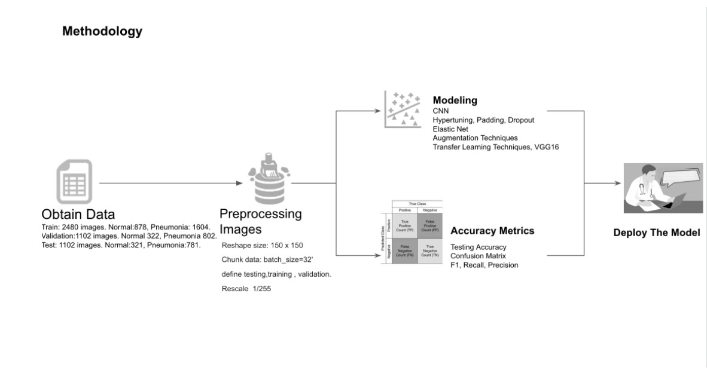

# Pneumonia Diagnosis Using Deep Learning Techniques

## X-RAY IMAGE CLASSIFICATION 
###  By Khulood Nasher & Seyma Tas

## Introduction
### Define the Problem

Disease diagnosis with radiology is a common practice in medicine  but requires doctors to interpret the results from the x-ray images. Due to the increase in the number of patients and the low availability of doctors, there was a need for a new method to diagnose .
Fortunately machine learning has introduced the solution for this problem . In this project we are going to introduce deep learning models and techniques in diagnosing pneumonia.
Through this project, we applied deep learning CNN techniques in image classification and we followed the data science methodlogy as follows:

# Obtain Data:

## About the X-ray images data:
An input of  total x-ray images of 4,704  were  downloaded  from kaggle, 

https://www.kaggle.com/paultimothymooney/chest-xray-pneumonia. 

The data images in  kaggle was not split appropriately, so we split the images  manually  with percentages of :60% train, 20% val, 20% test.

Our image data were as follows:

## Train data:
 
 2480 images belong to 2 classes: Normal and pneumonia.The Normal images in the training set  are 878 images, while the pneumonia images are 1604 images which is 
 
 almost double the number.

## Validation Data:

There are 1102 images belonging to 2 classes:Normal and pneumonia.The Normal images in the training set  are 322 images, while the pneumonia images are 802 images 

which is almost double the number.

## Test data:

There are 1102 images belonging to 2 classes:Normal and pneumonia.The Normal images in the training set  are 321 images, while the pneumonia images are 781 images 

which is almost double the number.
. 

